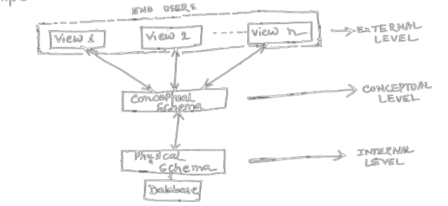
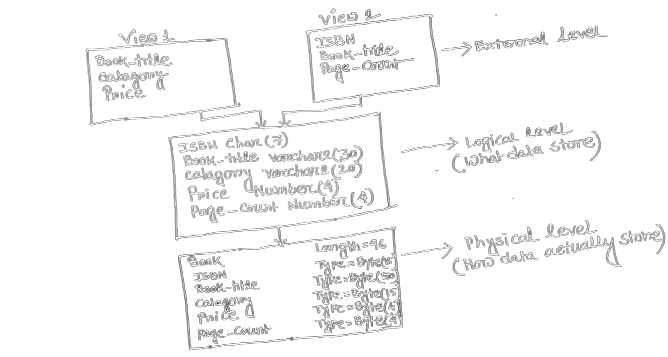

## What is data abstraction? Explain it.

<u>OR: </u>What you know about three level architecture of DBMS?

Data abstraction, the property of DBMS, allows the program-data independence. That means it allows the database system to provide an abstract view of data to its user without giving the physical storage and implementation details.

1. **External Level:-** It is the highest level of abstraction that deals with the user view of the database, so sometimes it is called view level. It permits users to access the data according to their needs. In this level users are not aware about how the data actually store in the database.

2. **Conceptual/Logical Level:-** This level of abstraction deals with the logical structure of the entire database. This level describes what data are stored in the database, and it also describes the relationship among those data.

3. **Internal/Physical Level:-** It is the lowest level of abstraction that deals with the physical representation of the database. That means it describe how the data actually store in a database by maintaining a physical structure.

An example of an online Book database are shown in following:

