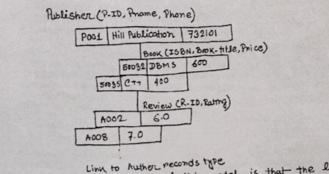
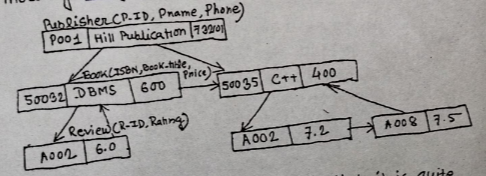

## Define the term data model. Explain different types of data models.

The data model is an abstract model that describes how data is represented. A data model consists of a set of data structures, which is used to describe the structure of a database. Data models are categorized into three types:

1. **Conceptual Data Model**
2. **Representational Data Model**
3. **Physical Data Model**

## 1. Conceptual Data Model

This data model describes the information used by an organization in a structured way. The main advantage of this model is that it is easy to understand for end users, including those without a technical background. However, this type of data model cannot directly imply implementation.

The most popular conceptual data model is the **Entity-Relationship Model (E-R Model).**

## 2. Representational Data Model

This type of data model hides some data storage details from users and is directly implemented on a computer system.

### a. Hierarchical Data Model

The hierarchical data model is structured like a tree, where each child node has one parent node. A set of records is connected to one another through links, with a one-to-many relationship between parent and child nodes. The top of the tree contains a single node that does not have any parent.

- Example:

:::info
The main limitation of this model is that links are permanently established and cannot be modified.
:::

### b. Network Data Model

The network data model represents data as a collection of records with relationships among them defined by links. Unlike the hierarchical model, a parent node can have multiple child nodes, and a child node can also have multiple parent nodes, forming a **many-to-many** relationship.

Example:

:::info
The main limitation of this model is that it is complex to maintain all the links, and errors in one link can cause problems for the entire database.
:::

### c. Relational Model

The relational model is widely used today. It represents data in the form of tables, where each row represents a record and each column represents an attribute (field).

Example:

<table>
    <thead>
        <tr>
            <th colspan="5">Book</th>
        </tr>
        <tr>
            <th>ISBN</th>
            <th>Book Title</th>
            <th>Category</th>
            <th>Price</th>
            <th>Pages</th>
        </tr>
    </thead>
    <tbody>
        <tr>
            <td>8002</td>
            <td>Java</td>
            <td>Text</td>
            <td>600</td>
            <td>650</td>
        </tr>
        <tr>
            <td>8005</td>
            <td>C++</td>
            <td>Text</td>
            <td>400</td>
            <td>380</td>
        </tr>
    </tbody>
</table>

### d. Object-Based Data Model

The object-based data model is a modern approach where each entity is treated as an object, similar to Object-Oriented Programming (OOP).

## 3. Physical Data Model

This model describes the data in terms of a collection of files, indices, and other storage structures such as records and formats.  
It specifies how the database will be executed in a particular **DBMS software** such as Oracle or IBM DB2. It also defines the methods for storing data on disks and retrieving it efficiently.
