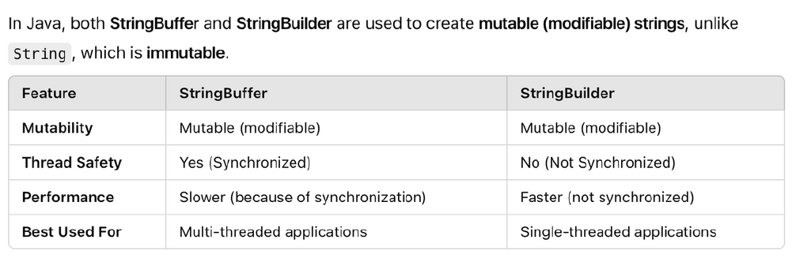

## 1. What are JDK, JRE, JVM?

- JVM (Java Virtual Machine): The Java Virtual Machine (JVM) is a platform-independent virtual machine that executes Java bytecode. It provides the runtime environment necessary for Java programs to run on any OS with a compatible JVM implementation. Its platform independence is a core feature of the Java language

- JRE (Java Runtime Environment): The JRE provides the environment in which Java applications can run. It includes the JVM, core class libraries (like those for I/O, networking, utilities), and other supporting files.

- JDK (Java Development Kit): The JDK is a superset of the JRE and is required for developing Java applications. It includes the JRE along with development tools such as the Java compiler (javac), debugger (jdb), and other utilities necessary for writing, compiling, and testing Java code.

### Difference between OOP & POP

## What Is The Difference Between OOP and POP?

| **OOP**                                                 | **POP**                                                               |
| ---------------------------------------------------------------- | ------------------------------------------------------------------------------ |
| Deals with objects and their properties.                         | Deals with functions and procedures.                                           |
| Follows a bottom-up approach.                                    | Follows a top-down approach.                                                   |
| Supports data hiding through encapsulation.                      | No data hiding mechanism.                                                      |
| Supports polymorphism through method overloading and overriding. | Does not support polymorphism; functions/procedures can't take multiple forms. |
| Promotes code reusability and scalability.                       | Code reusability is limited and scalability is harder.                         |

---

## 2. Explain the meaning of each word: `public static void main(String args[]) {}`

This is the main method which serves as the entry point for Java applications.

- `public`: Accessible from anywhere.
- `static`: No object needed to call it.
- `void`: Returns nothing.
- `main`: Entry point of the program.
- `String[] args`: Command line arguments.

## 3. What are the types of Data Types in Java?

Data types are divided into two groups:

#### Primitive

Primitive data types are the most basic data types available in Java. They are built into the language and are not objects. They hold direct values of a specific type and size.  

- Includes byte, short, int, long, float, double, boolean and char

##### byte

An 8-bit signed two's complement integer. Useful for saving memory in large arrays where memory savings are important.

- Range: -128 to 127
- Example: `byte myByte = 100;`

##### short

Short is a 16-bit signed two's complement integer

- Range: -32,768 to 32,767
- Example: `short myShort = 5000;`

##### int

A 32-bit signed two's complement integer. This is the default data type for integral values unless memory is a critical concern.

- Range: Approximately -2 billion to 2 billion
- Example: `int myInt = 100000;`

##### long

A 64-bit signed two's complement integer. Used when a wider range than int is needed.

- Range: Approximately -9 quintillion to 9 quintillion
- Example: `long myLong = 100000000000L;` (Note the 'L' suffix is required for long literals)

##### float

A single-precision 32-bit IEEE 754 floating-point number. Used for decimal numbers when precision is not critical.

- Range: Approximately ±3.40282347E+38F (6-7 significant decimal digits)
- Example: `float myFloat = 5.75f;` (Note the 'f' suffix is required for float literals)

##### double

A double-precision 64-bit IEEE 754 floating-point number. This is the default for decimal values and provides more precision than float.

- Range: Approximately ±1.79769313486231570E+308 (15 significant decimal digits)
- Example: `double myDouble = 19.99;`

##### boolean

Represents a binary value that can only be true or false.

- Range: true or false
- Example: `boolean isJavaFun = true;`

##### char

Represents a single 16-bit Unicode character.

- Example: `char myGrade = 'A';`

#### Non-primitive

Non-primitive data types are not predefined by the Java language itself. They are defined by the Java API or created by the programmer. Instead of storing the actual data value directly, they store the memory address (a reference) where the object's data is located.  

- Includes String, Arrays and Classes.

##### String

A sequence of characters represented as a Java object. String objects are immutable, meaning their values cannot be changed after creation.  
String is a class in the java.lang package.

- Example:

    ```java
    String greeting = "Hello, Java!";
    String name = new String("Alice"); // Can also be created using 'new'
    ```

- Common methods: `length()`, `charAt()`, `substring()`, `equals()`, `concat()`

##### Arrays

An array is a fixed-size data structure that stores multiple values of the same data type in contiguous memory locations

- Declaration: `dataType[] arrayName;` or `dataType arrayName[];`
- Example:

    ```java
    int[] numbers = {10, 20, 30, 40, 50};
    System.out.println(numbers[2]);
    ```

:::note
indexing of array starts with 0.  
like 1st element will be at index 0.
:::

##### Classes

User-defined blueprint for creating objects that encapsulates data and behaviors. Classes are the fundamental units of object-oriented programming in Java.

- Example:

  ```java
  public class Student {
      // Fields (data)
      private String name;
      private int age;
      
      // Constructor
      public Student(String name, int age) {
          this.name = name;
          this.age = age;
      }
      
      // Methods (behavior)
      public String getName() {
          return name;
      }
  }
  ```

- Usage: `Student student = new Student("John", 20);`

## 3b. What is Wrapper class?

A wrapper class in Java is a class that encapsulates (wraps) a primitive data type into an
object. The wrapper classes are part of the `java.lang` package.

Common wrapper classes:
- Integer for int
- Double for double
- Character for char
- Boolean for boolean

Wrapper classes are useful when you need to treat primitive data types as objects.


### What are StringBuilder & StringBuffer?


### Write a Java Program to reverse a String using StringBuffer & without StringBuffer

- **With StringBuffer**:-

    ```java
    public class Reverse {
        public static void main(String[] args) {
            String str = "DCST";
            StringBuffer sb = new StringBuffer(str);
            System.out.println("Reversed: " + sb.reverse());
        }
    }
    ```

- **Without StringBuffer**:-

    ```java
    
    public class Reverse {
        public static void main(String[] args) {
            String str = "DCST";
            String reversed = "";
    
            for (int i = str.length() - 1; i >= 0; i--) {
                reversed += str.charAt(i);
            }
    
            System.out.println("Reversed: " + reversed);
        }
    }
    ```

## 3a. What is a Package in Java?

A **package** is a  group of similar types of classes, interfaces, and sub-packages. It is used to group related types (classes, interfaces, enumerations, and annotations) and avoid name conflicts.

## 4. What are the types of Operators?

In Java, operators are special symbols used to perform operations on variables and values. Java supports several types of operators, each with specific functions.

| Type of Operator | Common Symbols                    |
| ---------------- | --------------------------------- |
| Arithmetic       | `+`, `-`, `*`, `/`, `%`           |
| Assignment       | `=`, `+=`, `-=`, `*=`, `/=`, `%=` |
| Relational       | `==`, `!=`, `>`, `<`, `>=`, `<=`  |
| Logical          | `&&`, `                           |                             | `, `!` |
| Bitwise          | `&`, `                            | `, `^`, `~`, ``<<``, ``>>`` |

### Explain each: Arithmetic, Assignment, Logical, Bitwise, Relational (with examples).

### What is an Array?
An array is a data structure that stores a collection of elements of the same data type. They are useful for storing and managing collections of data.   
Arrays in Java are objects, which makes them work differently from arrays in C/C++ in terms of memory management. 

### Write a program to find the highest element from an Array.
```java
public class MaxInArray {
    public static void main(String[] args) {
        int[] numbers = {12, 45, 7, 89, 23, 67};

        int max = numbers[0];  // Assume first element is max

        for (int i = 1; i < numbers.length; i++) {
            if (numbers[i] > max) {
                max = numbers[i];  // Update max if current element is greater
            }
        }

        System.out.println("The highest element is: " + max);
    }
}
```

## 5. Difference between Class & Objects


| Feature            | Class                                                  | Object                                                 |
| ------------------ | ------------------------------------------------------ | ------------------------------------------------------ |
| Definition         | A class is a blueprint or template.                    | An object is an instance of a class.                   |
| Memory             | No memory is allocated when class is defined.          | Memory is allocated when object is created.            |
| Usage              | Defines properties and behaviors (fields and methods). | Represents real-world entities using those properties. |
| Declaration        | `class Student { int id; String name; }`               | `Student s1 = new Student();`                          |
| Real-world Analogy | Like a **design** for a car.                           | Like a **real car** built from that design.            |


## 6. What is Polymorphism?

Polymorphism in Java is a feature that allows an entity to perform different operations in different scenarios. This means the same method can behave differently based on the type of object it is called on.

Polymorphism is primarily achieved through two mechanisms: method overriding and method overloading.

## Difference between Method Overloading & Method Overriding.

| Feature                       | Method Overloading                                                              | Method Overriding                                                                                                   |
| :---------------------------- | :------------------------------------------------------------------------------ | :------------------------------------------------------------------------------------------------------------------ |
| **Polymorphism Type**         | Compile-time polymorphism.                                                      | Run-time polymorphism.                                                                                              |
| **Primary Purpose**           | Helps to increase the readability of the program.                               | Used to grant the specific implementation of the method that is already provided by its parent class or superclass. |
| **Occurrence**                | Occurs within the same class or across different classes.                       | It is performed in two classes with inheritance relationships.                                                      |
| **Inheritance Requirement**   | Does not require inheritance.                                                   | Always needs inheritance.                                                                                           |
| **Method Signature**          | Methods must have the same name but different signatures.                       | Methods must have the same name and the same signature.                                                             |
| **Return Type**               | The return type can or can not be the same, but the parameter list must differ. | The return type must be the same or covariant.                                                                      |
| **Binding**                   | Static binding is used for overloaded methods.                                  | Dynamic binding is used for overriding methods.                                                                     |
| **Private and Final Methods** | Private and final methods can be overloaded.                                    | Private and final methods can't be overridden.                                                                      |
| **Argument List**             | The argument list should be different while doing method overloading.           | The argument list should be the same in method overriding.                                                          |

## Explain Runtime Polymorphism & Compile-time Polymorphism.

#### 1. Compile-time Polymorphism (Static Polymorphism)

Compile-time polymorphism is resolved by the compiler during the compilation phase of the program. The compiler determines which method to call based on the method signature (method name and the type and order of its parameters).

It is primarily achieved in Java through Method Overloading.

#### 2. Runtime Polymorphism (Dynamic Polymorphism)

Runtime polymorphism is resolved during the execution of the program (at runtime). The decision of which method to execute is made by the Java Virtual Machine (JVM) based on the actual type of the object whose method is being called, not the type of the reference variable.

It is primarily achieved in Java through Method Overriding and Inheritance.


## 7. What is Inheritance?

Inheritance is a fundamental mechanism in Object-Oriented Programming (OOP) where a new class (called a subclass or derived class) acquires the properties (fields/attributes) and behaviors (methods) of an existing class (called a superclass or base class).

Think of it like a parent-child relationship in the real world. A child inherits certain traits from their parents. Similarly, in OOP, a subclass inherits features from its superclass, allowing for code reuse and establishing an "is-a" relationship (e.g., a Dog is an Animal).


### What is superclass & subclass?

- Superclass (or Base Class / Parent Class):
This is the class whose properties and methods are inherited by another class. It's the class "from which" inheritance occurs.

- Subclass (or Derived Class / Child Class / Extended Class):
This is the class that inherits properties and methods from a superclass. It's the class "that inherits." It can also add its own unique properties and methods.

### Types: Single Inheritance, Multilevel Inheritance, Hierarchical Inheritance (with examples).

#### 1. Single Inheritance

In single inheritance, a subclass inherits from only one superclass. This is the simplest form of inheritance.

```java
// Superclass
class Vehicle {
    public void startEngine() {
        System.out.println("Engine started.");
    }
}

// Subclass inheriting from Vehicle
class Car extends Vehicle { // Car is a subclass of Vehicle
    public void drive() {
        System.out.println("Car is moving.");
    }
}

public class SingleInheritanceDemo {
    public static void main(String[] args) {
        Car myCar = new Car();
        myCar.startEngine(); // Inherited from Vehicle
        myCar.drive();       // Own method
    }
}

```

#### 2. Multilevel Inheritance

In multilevel inheritance, a subclass inherits from another subclass, forming a chain or level of inheritance. A class acts as a subclass to one class and a superclass to another.

```java
// Superclass (Level 0)
class Animal {
    void eat() {
        System.out.println("This animal eats food.");
    }
}

// Subclass (Level 1) - inherits from Animal
class Mammal extends Animal {
    void giveBirth() {
        System.out.println("This mammal gives birth to live young.");
    }
}

// Subclass (Level 2) - inherits from Mammal
class Dog extends Mammal {
    void bark() {
        System.out.println("The dog barks.");
    }
}

public class MultilevelInheritanceDemo {
    public static void main(String[] args) {
        Dog myDog = new Dog();
        myDog.eat();        // Inherited from Animal
        myDog.giveBirth();  // Inherited from Mammal
        myDog.bark();       // Own method
    }
}

```

#### 3. Hierarchical Inheritance

In hierarchical inheritance, multiple subclasses inherit from a single superclass. This means one superclass can have many subclasses.

```java
// Superclass
class Shape {
    public void displayShape() {
        System.out.println("This is a shape.");
    }
}

// Subclass 1 - inherits from Shape
class Circle extends Shape {
    public void drawCircle() {
        System.out.println("Drawing a circle.");
    }
}

// Subclass 2 - inherits from Shape
class Rectangle extends Shape {
    public void drawRectangle() {
        System.out.println("Drawing a rectangle.");
    }
}

public class HierarchicalInheritanceDemo {
    public static void main(String[] args) {
        Circle myCircle = new Circle();
        myCircle.displayShape(); // Inherited from Shape
        myCircle.drawCircle();   // Own method

        System.out.println("---");

        Rectangle myRectangle = new Rectangle();
        myRectangle.displayShape(); // Inherited from Shape
        myRectangle.drawRectangle();  // Own method
    }
}

```

---

## 8. Which inheritance Java does not support?

Java does not support Multiple Inheritance.

### What is Interface?

In Java, an interface is an abstract type used to specify the behavior of a class, acting as a blueprint of a behavior. It contains static constants and abstract methods. Interfaces are used to achieve abstraction and implement multiple inheritance. Unlike classes, interfaces cannot be instantiated; they can only be implemented by classes or extended by other interfaces.

### Which keyword is used to write inheritance?

Java uses two main keywords related to inheritance:

1. `extends`: Used for class inheritance (a subclass inherits from a superclass). 
2. `Implements`: Used for a class to implement an interface (or multiple interfaces).


## 9. What is Abstraction?

Abstraction is the process of hiding internal implementation details from user.  
Abstraction can be achieved with either abstract classes or interfaces

### Difference between Interface & Abstraction (with examples).

| Points                    | Abstract Class                                                                                                      | Interface                                                                           |
| :------------------------ | :------------------------------------------------------------------------------------------------------------------ | :---------------------------------------------------------------------------------- |
| **Definition**            | Cannot be instantiated; contains both abstract (without implementation) and concrete methods (with implementation). | Specifies a set of methods a class must implement; methods are abstract by default. |
| **Implementation Method** | Can have both implemented and abstract methods.                                                                     | Methods are abstract by default; Java 8, can have default and static methods.       |
| **Inheritance**           | A class can inherit from only one abstract class.                                                                   | A class can implement multiple interfaces.                                          |
| **Access Modifiers**      | Methods and properties can have any access modifier (public, protected, private).                                   | Methods and properties are implicitly public.                                       |
| **Variables**             | Can have member variables (final, non-final, static, non-static).                                                   | Variables are implicitly public, static, and final (constants).                     |

### Explain with example.
:::info
Dada ke jiggesh korte hbe
:::

### Explain: static keyword, this keyword, super keyword, final keyword.


#### `static` keyword

The static keyword makes a field or method belong to the class, not instances(objects). It is shared by all objects.
without creating objects, I can access the methods directly

```java
class Counter {
    static int count = 0;  // Static field
    
    static void increment() {  // Static method
        count++;
    }
}
```

#### `this` keyword

The this keyword refers to the current object within the class, used to distinguish between class fields and parameters with the same name.

```java
class Person {
    String name;
    
    Person(String name) {
        this.name = name;  // 'this' refers to the field of the object
    }
}

```

#### `super` keyword

In Java, the super keyword is used to refer to the immediate parent class of a subclass and can be used to call methods or constructors of the parent class. 


#### `final` keyword

The final keyword in Java is used to restrict the modification or extension of variables, methods, or classes. 
When a variable is declared as final, its value cannot be changed after initialization. 
A method declared as final cannot be overridden by subclasses, and a class declared as final cannot be extended.


## 10. What is Encapsulation?

- Give an example.
- What are the types of Constructor? (with example)
- Explain Thread Life Cycle with diagram.
- Explain different types of Errors.
